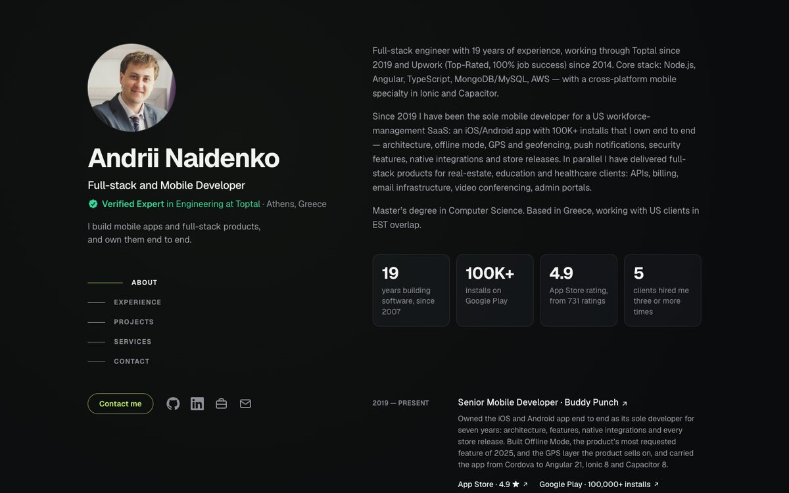

# naidenko.dev

The personal site of Andrii Naidenko, a full-stack and mobile developer: one page with his
work, his open-source Claude Code plugins and a contact form.



## Stack

- **Next.js 16** (App Router) exported to static HTML, React 19, TypeScript
- **Tailwind CSS 4**
- **Cloudflare Workers**: the static export is served as assets; one Worker route,
  `POST /api/contact`, checks Cloudflare Turnstile and mails the message with the Email
  Service binding
- **Two cookieless counters, so no consent banner:** GoatCounter for its dashboard, and the
  site's own counter (`POST /api/hit` into Cloudflare D1) with a password-protected `/stats`
  page
- **Vitest** for the Worker and the helpers; **Playwright** and **axe** for end-to-end and
  accessibility tests
- **Prettier** (4 spaces) and **ESLint**; **GitHub Actions** runs every check

## Run it

```bash
pnpm install
cp .dev.vars.example .dev.vars   # Cloudflare's public Turnstile test keys
pnpm build && pnpm preview       # the site plus the Worker on http://127.0.0.1:8788
```

`pnpm dev` runs the Next.js dev server on port 3000 for layout work. The contact form needs
the Worker, so test it with `pnpm preview`, where the email is only logged.

## Test

```bash
pnpm test          # unit tests: validation, the Worker, analytics, scripts
pnpm test:e2e      # builds with e2e/e2e.env, starts wrangler dev, runs Playwright and axe
pnpm typecheck && pnpm lint && pnpm format:check
```

The end-to-end tests use the installed Google Chrome locally (Playwright's Chromium in CI) and
reach `challenges.cloudflare.com` for Turnstile's test keys. Google Analytics is stubbed.

## Configuration

| Setting | Where it goes | What it does |
|---|---|---|
| `NEXT_PUBLIC_TURNSTILE_SITE_KEY` | build: `.env.production.local` | Turnstile widget key (public). `pnpm run deploy` refuses to run without it. |
| `NEXT_PUBLIC_GOATCOUNTER_URL` | build: `.env.production.local` | GoatCounter's count endpoint, `https://CODE.goatcounter.com/count`. |
| `TURNSTILE_SECRET_KEY` | Worker secret | Verifies Turnstile tokens. |
| `CONTACT_TO` | Worker secret | The inbox that receives the form: a verified Email Routing destination. |
| `SLACK_WEBHOOK_URL` | Worker secret | A Slack incoming webhook for form alerts. When the email fails, the message itself goes there, so it is not lost. |
| `STATS_PASSWORD` | Worker secret | The password for `/stats`. Without it the page does not exist. |
| `STATS_DB` | `wrangler.jsonc` | The D1 database `naidenko-stats`, created with `wrangler d1 create`. Its schema is in `worker/migrations/`. |
| `CONTACT_FROM` | `wrangler.jsonc` | The sender address, on the site's domain. |

`.env.example` lists the build settings. Locally, the Worker reads `.dev.vars`. Neither
`.env*.local` nor `.dev.vars` is committed.

## Deploy to Cloudflare

Hosting, the TLS certificate, the email relay and Turnstile are free. The domain is the only
cost.

1. **Domain.** Register it with Cloudflare Registrar, or add an existing one. Its DNS then lives
   in Cloudflare.
2. **Email Routing** (Email → Email Routing):
   - enable it for the domain;
   - add the destination inbox and click the link in the verification email;
   - add a custom address, such as `hello@` → that inbox.
3. **Turnstile** (Turnstile → Add widget): mode Managed, hostname = the domain. Copy the site
   key and the secret key.
4. **GoatCounter:** sign up at goatcounter.com and copy the count endpoint. The free plan keeps
   six months; the site's own counter keeps everything.
5. **Secrets:**
   ```bash
   pnpm exec wrangler login
   pnpm exec wrangler secret put TURNSTILE_SECRET_KEY
   pnpm exec wrangler secret put CONTACT_TO
   pnpm exec wrangler secret put SLACK_WEBHOOK_URL
   pnpm exec wrangler secret put STATS_PASSWORD
   ```
6. **Build settings:** create `.env.production.local` with the Turnstile site key and the
   GoatCounter endpoint.
7. **Deploy:** run `pnpm run deploy`. A bare `pnpm deploy` is pnpm's own command. The script:
   - refuses to run without the site key and the GoatCounter endpoint;
   - rebuilds;
   - checks that `out/` carries none of the test values from `e2e/e2e.env`;
   - checks that the four Worker secrets exist;
   - applies new D1 migrations;
   - deploys.

   Never run `wrangler deploy` directly: it uploads whatever is in `out/`, which after
   `pnpm test:e2e` is a test build. The route in `wrangler.jsonc` attaches the domain, and the
   certificate is issued automatically.
8. **Search:** add the domain to Google Search Console (DNS verification) and submit
   `/sitemap.xml`.

## Alerts

The Worker posts to Slack through `SLACK_WEBHOOK_URL` when:
- the email does not go out: the alert carries the message itself, and the visitor is told it
  went through;
- Turnstile refuses the site's own check: a wrong secret, or siteverify out of reach;
- anything else fails unexpectedly.

A visitor's bad or expired token raises no alert. When Slack cannot be reached, the alert goes to
the Worker's logs instead. Stream the live logs with `pnpm exec wrangler tail naidenko-dev`. Past
logs are in the dashboard under the Worker's Logs, because Wrangler's login cannot query them.

## Analytics events

Every event goes to both counters. GoatCounter names it `<event>-<values of its parameters>`,
such as `hire_me_toptal-badge`; `/stats` lists it as `hire_me_toptal · badge`.

| Event | When | Parameters |
|---|---|---|
| `contact_click` | "Contact me" in the header | — |
| `hire_me_toptal` | "Hire me" on the Toptal badge | `placement` |
| `toptal_profile_click` | "View full résumé on Toptal" | `placement` |
| `profile_click` | GitHub, LinkedIn or Toptal icon | `network` |
| `email_click` | Any email link | `placement` |
| `client_site_click` | A client's name in Experience | `company` |
| `store_click` | App Store or Google Play | `store` |
| `project_click` | A repository in Projects | `project` |
| `copy_install` | The install-command copy button | — |
| `generate_lead` | The form was sent | `form` |
| `form_error` | The form could not be sent | `form`, `reason` (`rate_limit` when limited) |

To track a new link or button, give it `data-track="<event>"` and any
`data-track-<param>="<value>"`.

## Layout

| Path | What lives there |
|---|---|
| `src/content/` | All copy and links, one file per section |
| `src/components/` | One component per block of the page |
| `src/app/` | The pages, the link-preview image, `robots.txt` and `sitemap.xml` |
| `src/lib/` | Form validation shared with the Worker; the Turnstile client; analytics |
| `worker/` | The Worker: the contact endpoint and Turnstile verification |
| `e2e/` | Playwright tests, accessibility checks, review screenshots |
| `assets/` | Fonts and the photo for the generated images |
| `scripts/` | The deploy guard and the env-file runner |

## Credits

- The layout is inspired by [Brittany Chiang](https://brittanychiang.com)'s site. The code is
  original.
- The frames in the claude-video-digest image are from Big Buck Bunny, © Blender Foundation,
  licensed under CC BY 3.0.
- The Geist font is © Vercel and licensed under the SIL Open Font License 1.1
  (`assets/fonts/OFL.txt`).
