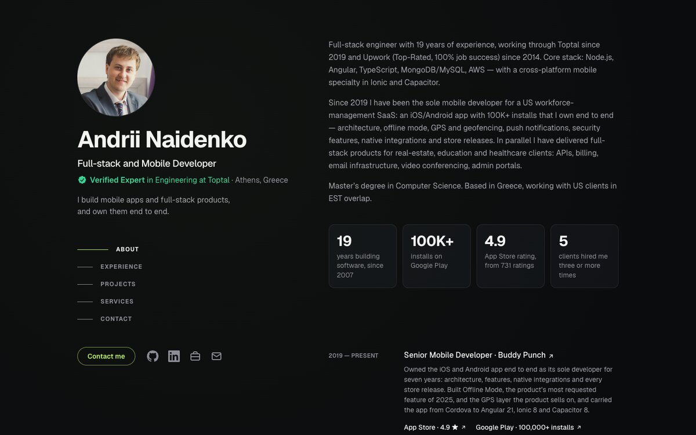

# naidenko.dev

The personal site of Andrii Naidenko, a full-stack and mobile developer: one page with his
work, his open-source Claude Code plugins and a contact form. A second build of it,
`toptal.naidenko.dev`, is the address for Toptal's links: the same pages with no way to reach him
but Toptal.



## Stack

- **Next.js 16** (App Router) exported to static HTML, React 19, TypeScript
- **Tailwind CSS 4**
- **Cloudflare Workers**: each static export is served as assets by a Worker of its own; the
  site's Worker answers `POST /api/contact`, which checks Cloudflare Turnstile and mails the
  message with the Email Service binding
- **Two cookieless counters, so no consent banner:** GoatCounter for its dashboard, and the
  site's own counter (`POST /api/hit` into Cloudflare D1: each visit, its clicks and its visible
  time) with a password-protected `/stats` page
- **Vitest** for the Worker and the helpers; **Playwright** and **axe** for end-to-end and
  accessibility tests
- **Prettier** (4 spaces) and **ESLint**; **GitHub Actions** runs every check

## Run it

```bash
pnpm install
cp .dev.vars.example .dev.vars   # Cloudflare's public Turnstile test keys
pnpm build && pnpm preview       # the site plus the Worker on http://127.0.0.1:8788
pnpm build:toptal && pnpm preview:toptal   # the Toptal build on http://127.0.0.1:8789
```

`pnpm dev` runs the Next.js dev server on port 3000 for layout work. The contact form needs
the Worker, so test it with `pnpm preview`, where the email is only logged. The Toptal build's
Worker counts its visits through the site's: run both previews.

## Test

```bash
pnpm test          # unit tests: validation, the Worker, analytics, scripts
pnpm test:e2e      # builds both with e2e/e2e.env, starts both Workers, runs Playwright and axe
pnpm typecheck && pnpm lint && pnpm format:check
```

The end-to-end tests run Playwright's headless Chromium, locally and in CI; install it once with
`pnpm exec playwright install --only-shell chromium`. They reach `challenges.cloudflare.com` for
Turnstile's test keys, and GoatCounter is stubbed.

## Configuration

| Setting | Where it goes | What it does |
|---|---|---|
| `NEXT_PUBLIC_TURNSTILE_SITE_KEY` | build: `.env.production.local` | Turnstile widget key (public). `pnpm run deploy` refuses to run without it. |
| `NEXT_PUBLIC_GOATCOUNTER_URL` | build: `.env.production.local` | GoatCounter's count endpoint, `https://CODE.goatcounter.com/count`. |
| `TURNSTILE_SECRET_KEY` | Worker secret | Verifies Turnstile tokens. |
| `CONTACT_TO` | Worker secret | The inbox that receives the form: a verified Email Routing destination. |
| `SLACK_WEBHOOK_URL` | Worker secret | A Slack incoming webhook: a copy of every message, and alerts when something fails. |
| `STATS_PASSWORD` | Worker secret | The password for `/stats`: a long random string used nowhere else (`openssl rand -base64 24`). Without it the page does not exist. An address gets ten tries a minute, and an IPv6 /64 counts as one address. |
| `VISITOR_KEY` | Worker secret | The key of the visitor hash, which tells a returning visitor from a new one: a long random string (`openssl rand -hex 32`). Changing it makes every visitor new. |
| `IGNORE_NETWORKS` | Worker secret (optional) | CIDR ranges or addresses, comma-separated, whose visits are not counted: the owner's own network. A secret, so no address reaches the public repository. |
| `STATS_DB` | `wrangler.jsonc` | The D1 database `naidenko-stats`, created with `wrangler d1 create`. Its schema is in `worker/migrations/`. |
| `CONTACT_FROM` | `wrangler.jsonc` | The sender address, on the site's domain. |
| `GOATCOUNTER_DASHBOARD` | `wrangler.jsonc` | GoatCounter's dashboard, linked from `/stats` for the same dates. Empty means no link. |
| `TOPTAL_ORIGIN` | `wrangler.jsonc` | The Toptal build's origin, where a page tagged `?ref=toptal…` moves. Empty turns the move off. |
| `SITE` | `wrangler.toptal.jsonc` | The Toptal build's service binding to the site's Worker (`naidenko-dev`), which counts its visits. |
| `NEXT_PUBLIC_SITE_VARIANT` | build: `pnpm build:toptal` | `toptal` builds the Toptal variant into `out-toptal/`. |

`.env.example` lists the build settings. Locally, the Worker reads `.dev.vars`. Neither
`.env*.local` nor `.dev.vars` is committed.

## Deploy to Cloudflare

Hosting, the TLS certificate, the email relay and Turnstile are free. The domain is the only
cost.

1. **Domain.** Register it with Cloudflare Registrar, or add an existing one. Its DNS then lives
   in Cloudflare.
2. **Email Routing** (Email → Email Routing):
   - enable it for the domain;
   - add the destination inbox and click the link in the verification email;
   - add a custom address, such as `hello@` → that inbox.
3. **Turnstile** (Turnstile → Add widget): mode Managed, hostname = the domain. Copy the site
   key and the secret key.
4. **GoatCounter:** sign up at goatcounter.com and copy the count endpoint. The free plan keeps
   six months; the site's own counter keeps everything.
5. **Secrets:**
   ```bash
   pnpm exec wrangler login
   pnpm exec wrangler secret put TURNSTILE_SECRET_KEY
   pnpm exec wrangler secret put CONTACT_TO
   pnpm exec wrangler secret put SLACK_WEBHOOK_URL
   pnpm exec wrangler secret put STATS_PASSWORD
   pnpm exec wrangler secret put VISITOR_KEY
   pnpm exec wrangler secret put IGNORE_NETWORKS   # optional
   ```
6. **Build settings:** create `.env.production.local` with the Turnstile site key and the
   GoatCounter endpoint.
7. **Deploy:** run `pnpm run deploy`. A bare `pnpm deploy` is pnpm's own command. The script:
   - refuses to run without the site key and the GoatCounter endpoint;
   - rebuilds both builds;
   - checks that neither carries a test value from `e2e/e2e.env`, and that the Toptal build leads
     only to Toptal: no address but the privacy note's, no `naidenko.dev` outside its own host, no
     LinkedIn or GitHub profile (`scripts/check-build.mjs --toptal`);
   - checks that every page, file and anchor either build links to exists
     (`scripts/check-links.mjs`; CI runs it too);
   - checks that the five required Worker secrets exist;
   - applies new D1 migrations;
   - deploys the Toptal build's Worker, then the site's, whose move of tagged pages points at the
     first.

   The daily cron needs the account's `workers.dev` subdomain: open Workers & Pages in the
   dashboard once. Without it the deploy exits with an error at "Cron schedules" (10063) after
   the new code is already live; `pnpm exec wrangler triggers deploy` attaches the cron later.

   Never run `wrangler deploy` directly: it uploads whatever is in `out/` or `out-toptal/`,
   which after `pnpm test:e2e` is a test build. The routes attach the custom domains,
   `naidenko.dev` (`wrangler.jsonc`) and `toptal.naidenko.dev` (`wrangler.toptal.jsonc`), and
   Cloudflare creates their DNS records and certificates.
8. **Search:** add the domain to Google Search Console (DNS verification) and submit
   `/sitemap.xml`.

## Alerts

The Worker posts to Slack through `SLACK_WEBHOOK_URL`:
- a copy of every message, in case the email lands in spam. When the email does not go out,
  the post says so, and the visitor is still told the message went through;
- Turnstile refuses the site's own check: a wrong secret, or siteverify out of reach;
- anything else fails unexpectedly;
- a broken outside link, found by the daily cron (`worker/links.ts`). It reads the pages of the
  sitemap from the deployed build, checks the home page's links every day and the sample report's
  references fifteen a day, within the 50 requests a Free plan's cron may make. A link counts as
  broken on a 404 or 410, a network error, a timeout or a redirect loop, twice in a row. A 403,
  429 or 503 is a bot wall, not a dead page: it goes to the logs as unverified. LinkedIn is not
  checked (it answers 999 to any script, a missing profile included), nor Toptal (its terms bar
  scripts). Run it locally with `pnpm exec wrangler dev --test-scheduled`, then
  `curl "http://127.0.0.1:8787/__scheduled?cron=17+3+*+*+*"`.

A visitor's bad or expired token raises no alert. When Slack cannot be reached, the alert goes to
the Worker's logs instead. Stream the live logs with `pnpm exec wrangler tail naidenko-dev`. Past
logs are in the dashboard under the Worker's Logs, because Wrangler's login cannot query them.

## Visits

The page sends `/api/hit` its view, each section once as it scrolls into view, every tracked click
and the time it was visible. The Worker adds the place and network Cloudflare resolves, the
browser, system and language, and a keyed hash of the network and browser; it stores no IP
address. A daily cron erases the hashes older than 13 months, and the rest is kept.

- **Link tags:** `https://naidenko.dev/?ref=linkedin` (or `utm_source=`) shows under Link tags on
  `/stats`, which filters by tag, country and dates (the last 30 days by default) and compares each
  total with the period of the same length just before. A bounce is a visit that left within 10 s.
- **Tagged links on LinkedIn:** LinkedIn replaces a shared link with the page's canonical address,
  so for its crawler (`LinkedInBot`) the Worker adds the link's `?ref=` to the canonical link and
  `og:url` of every HTML page (`run_worker_first` sends every path without a dot to the Worker);
  everyone else sees the bare address, such as `https://naidenko.dev/audit`. Check a new link in
  [Post Inspector](https://www.linkedin.com/post-inspector/): its Canonical URL must keep `?ref=`.
  LinkedIn caches the card, so a link added before a fix has to be removed and added again.
- **Tagged by the referring site:** a visit GitHub sends without a tag counts as `github`, since
  the profile links the bare address and GitHub sends its origin as the referrer.
- **Visits through Toptal:** Toptal's profile guidance allows no link to a page "emphasizing your
  contact information". The form, the email and the header's email icon render only in the
  browser, so the static HTML and the Markdown never carry them, and the privacy note names
  `privacy@naidenko.dev` as text, with no link, as the GDPR asks. A page asked for with a tag
  `?ref=toptal…` or `utm_source=toptal…` (an old application's `toptal-<job id>`, the profile's
  `toptal`) moves with a 302 to the same path on the Toptal host (`TOPTAL_ORIGIN`), its tag in the
  form that host counts the same: `?ref=toptal` goes, `?ref=toptal-509168` becomes `?ref=509168`.
  With `TOPTAL_ORIGIN` empty it stays, in the page's own Toptal mode: an inline script marks
  `<html data-toptal>` before the first paint, and the page shows no form, no email and no
  "Contact me" (`src/lib/toptal.ts`). `/audit` offers no order, and its link home is `nofollow`.
- **The Toptal host:** `toptal.naidenko.dev` serves the Toptal build (`pnpm build:toptal`,
  `NEXT_PUBLIC_SITE_VARIANT=toptal`) from a Worker of its own (`worker/toptal-site.ts`,
  `wrangler.toptal.jsonc`): no form, no email, no icon row under the name, no LinkedIn or GitHub
  profile, and no link to `naidenko.dev`; the menu's last entry is "Hire", over the badge, and the
  sample report and its PDF link the Toptal host. Its pages carry `noindex`, its Worker sends
  `X-Robots-Tag: noindex` with every answer, files included, and its `robots.txt` keeps AI
  crawlers out. A link there takes a bare tag, such as a job's ID (`/audit?ref=509168`), counted
  as `toptal-509168`; a visit with no tag counts as `toptal`. Its own links carry a visit's tag in
  that bare form, so its addresses never show `toptal`. Its Worker has no database or
  secrets: it hands `/api/hit` to the site's Worker through a service binding, so one D1, one
  visitor key and one list of ignored networks count both hosts. On `/stats`, the link tag
  "Every Toptal link" (`?ref=toptal*`) shows the visits that came through Toptal; a move within a
  site is a visit with no tag, so it is not among them.
- **Not counted:** a load with `?preview=1`; a browser that has opened `/stats` (it sets
  GoatCounter's `skipgc` flag, which both counters honour), or any page with `?skipgc=t`, which
  sets the same flag; addresses in `IGNORE_NETWORKS`; bots, automated browsers, frames and
  prerendering, as GoatCounter's count.js skips them. The flag belongs to one host, and the Toptal
  host has no `/stats`: open `https://toptal.naidenko.dev/?skipgc=t` once in each of your
  browsers there.
- **Testing from an ignored network:** press "Count it again" on `/stats` in that browser (a
  private window keeps it until closed), or open a page with `?skipgc=f`. Its hits then carry
  `force: true` and are counted even from `IGNORE_NETWORKS`.

## Analytics events

Every event goes to both counters. GoatCounter names it `<event>-<values of its parameters>`,
such as `hire_me_toptal-badge`; `/stats` lists it as `hire_me_toptal · badge`.

| Event | When | Parameters |
|---|---|---|
| `contact_click` | "Contact me" in the header | — |
| `hire_me_toptal` | "Hire me" on the Toptal badge | `placement` |
| `toptal_profile_click` | "View full résumé on Toptal" | `placement` |
| `profile_click` | GitHub, LinkedIn or Toptal icon | `network` |
| `email_click` | Any email link | `placement` (`header`, `contact`, `form_error`) |
| `client_site_click` | A client's name in Experience | `company` |
| `testimonial_click` | A client's name or photo under "What clients said" (their LinkedIn) | `client` |
| `store_click` | App Store or Google Play | `store` |
| `project_click` | A project's title in Projects | `project` |
| `sample_report_click` | A link from `/audit` to the sample report | `placement` (`hero`, `screenshot`, `section`) |
| `sample_pdf` | The sample report's PDF | `placement` (`audit`, `sample`) |
| `sample_to_audit` | "How the audit works" on `/audit/sample` | — |
| `sample_filter` | A click in the sample report's filters | — |
| `copy_install` | The install-command copy button | — |
| `generate_lead` | The form was sent | `form` |
| `form_error` | The form could not be sent | `form`, `reason` (`rate_limit` when limited) |
| `nav_click` | A link in the in-page menu (wide screens) | `section` (a section's id, or `auditdesk` for "Code audit") |
| `section_view` | A section scrolled into view, once per visit (`/stats` only) | the section's id |

To track a new link or button, give it `data-track="<event>"` and any
`data-track-<param>="<value>"`.

## Layout

| Path | What lives there |
|---|---|
| `src/content/` | All copy and links, one file per section |
| `src/components/` | One component per block of the page |
| `src/app/` | The pages, the link-preview image, `robots.txt` and `sitemap.xml` |
| `src/lib/` | Form validation shared with the Worker; the Turnstile client; analytics |
| `worker/` | The site's Worker: the contact endpoint, Turnstile verification, the visit counter and `/stats`; the Toptal build's (`toptal-site.ts`) |
| `e2e/` | Playwright tests, accessibility checks, review screenshots |
| `assets/` | Fonts and the photo for the generated images |
| `scripts/` | The deploy guards, the env-file runner and the Toptal build's PDF |

## Credits

- The layout is inspired by [Brittany Chiang](https://brittanychiang.com)'s site. The code is
  original.
- The frames in the claude-video-digest image are from Big Buck Bunny, © Blender Foundation,
  licensed under CC BY 3.0.
- The Geist font is © Vercel and licensed under the SIL Open Font License 1.1
  (`assets/fonts/OFL.txt`).
